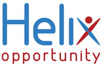
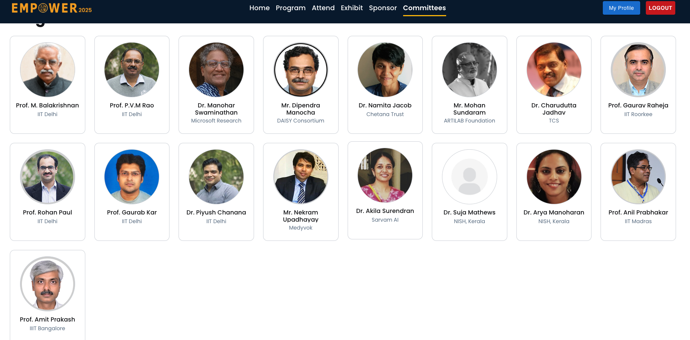
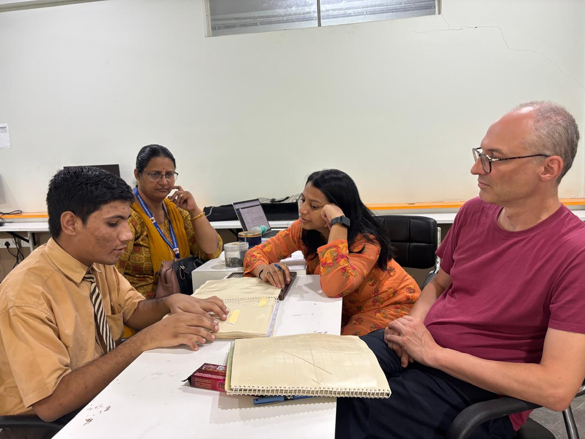
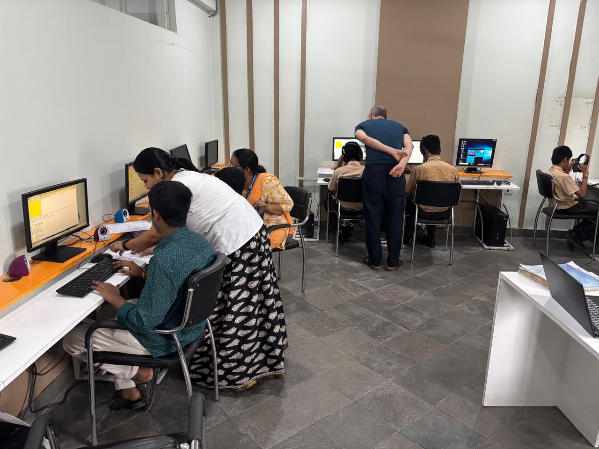
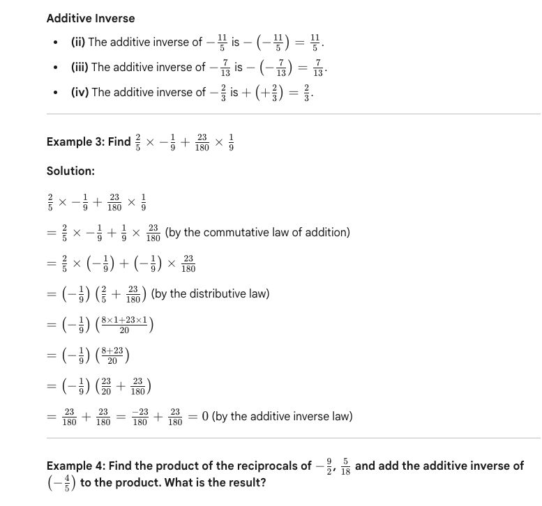
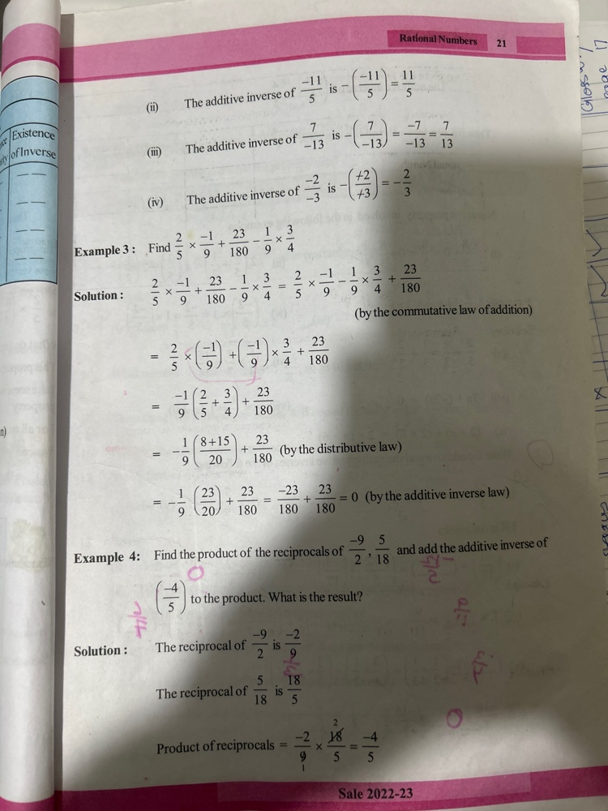
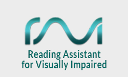

***Head

:::Icon Resources/logos/favicon.ico
:::CSS node_modules/normalize.css/normalize.css minify
:::CSS Resources/styles.css minify

:::

***

***TitleSlide

:::Title STEM Accessibility
:::Subtitle Research and Conversion
:::
:::Author  Neha Jadhav
:::

***Affiliations
:::Affiliation
Helix Opportunity, USA

[HelixOpp.com/](https://helixopp.com/)
[njadhav@helixopp.com](mailto:v.sorge@bham.ac.uk)
:::

:::Affiliation
Progressive Accessiblity Solutions, UK

[progacc.com](https://progressiveaccess.com)
[neha.jadhav@progressiveaccess.com](mailto:neha.jadhav@progressiveaccess.com)
:::

:::Affiliation
Indian Institute of Technology, Delhi

[iitd.ac.in](https://iitd.ac.in)
:::

*******************

## Empower Assistive Technology Conference

{width=5000}{style="float:right"}

## Research

{width=1000}{style="float:right"}
* Comprehension of diagrams by Visually Impaired students
* Tactile vs Prefigure
* Drawing of diagrams
* Three stages of study

## Stages of Research

{width=1000}{style="float:right"}
* Initial study
* Teaching
  * Tactile
  * Prefigure
* Prefigure improvement
* Post training study

## Observations

* Initial training
* Device comprehension
* Tactile comprehension
* Lack of training in both modalities

## Accessible Drawing: What is Prefigure?

* A web-based tool for creating and sharing diagrams and drawings
* Supports semantic annotation of shapes (level-wise)
* Outputs clean SVG or MathML so diagrams are machine-readable
* Study observations

## Conversion
{width=800}{style="float:right"}
{width=800}{style="float:right"}

* Existing tool problems
* Only text processing
* Comparison with Gemini
* Problems with Gemini

## Existing work

{width=600}{style="float:center"}
* RAVI - IIT Delhi
* Problem identification
* Pre AI/LLM project

## Current plan

* Prof. Volker Sorge
* Maths, Chemistry and Document accessibility
* Tested with one Physics chapter
* Implementation of rough pipeline for text 

## Thank you
? {style="font-size:32pt"}